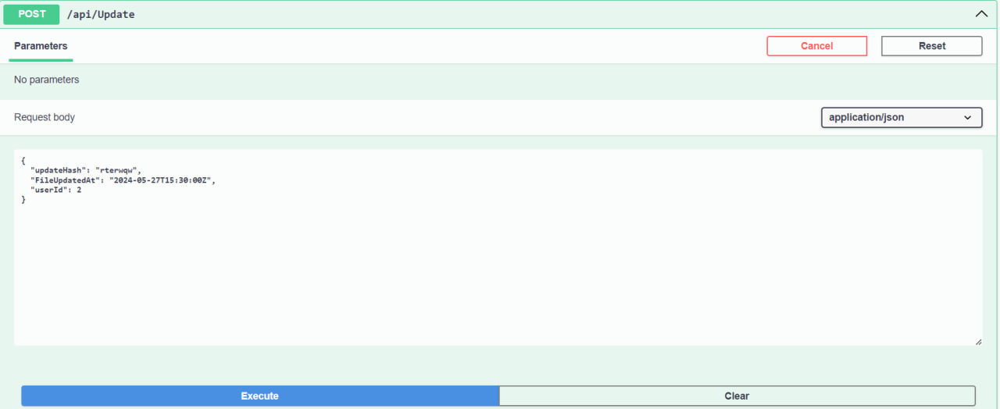
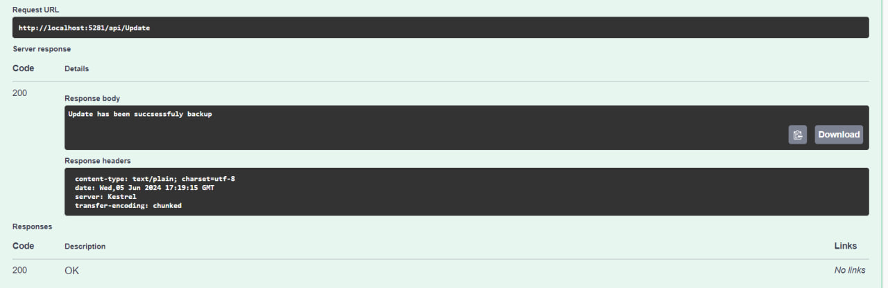
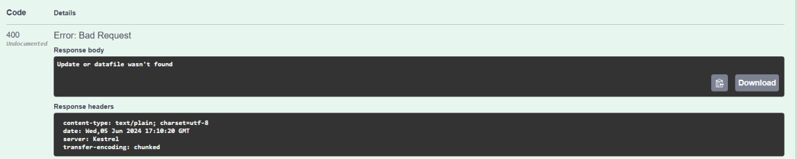
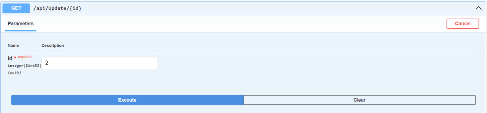
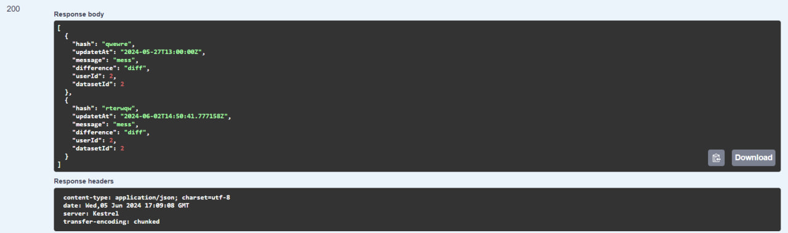

# Тестування працездатності системи

## Тестування бекапу змін 

### Запит



### Відповідь



### Запит

```json
{
  "updateHash": "rterwqw",
  "FileUpdatedAt": "2024-06-02T14:50:41.777158Z",
  "userId": 0
}
```

### Відповідь



## Тестування виводу всіх змін для окремого датасету

### Запит



### Відповідь


